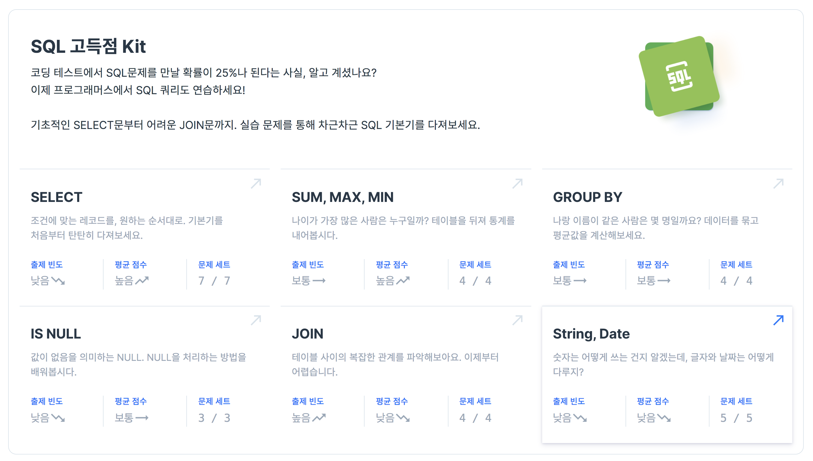

Programmers SQL Quiz
--------------------

# Introduction
프로그래머스 사이트에서 제공하는 SQL 고득점 Kit 문제 풀이 기록입니다.
- [SQL 고득점 Kit](https://programmers.co.kr/learn/challenges)
- 사이트에서 풀었던 문제의 해답만 기록합니다. ~~사이트도 먹고 살아야죠~~



# Select
## 1번 - 모든 레코드 조회하기
```sql
SELECT * 
from ANIMAL_INS
order by ANIMAL_ID ASC
```

## 2번 - 역순 정렬하기
```sql
SELECT 
    name, datetime
from animal_ins
order by animal_id DESC
```

## 3번 - 아픈 동물 찾기
```sql
SELECT
    animal_id, name
from animal_ins
where intake_condition = "sick"
```

## 4번 - 어린 동물 찾기
```sql
SELECT 
    animal_id, name
from animal_ins
where INTAKE_CONDITION != 'Aged'
order by 1
```

## 5번 - 동물의 아이디와 이름
```sql
SELECT
    animal_id,
    name
from animal_ins
order by 1 ASC
```

## 6번 - 여러 기준으로 정렬하기
```sql
SELECT
    animal_id,
    name,
    Datetime
from animal_ins
order by 2 ASC, 3 DESC
```

## 7번 - 상위 n개 레코드
```sql
SELECT name
from animal_ins
order by datetime ASC
limit 1
```

# SUM, MAX, MIN
## 1번 - 최댓값 구하기
```sql
SELECT max(Datetime)
from animal_ins
```

## 2번 - 최솟값 구하기
```sql
SELECT DATETIME as "시간"
from ANIMAL_INS
order by DATETIME
limit 1
```
## 3번 - 동물 수 구하기
```sql
SELECT count(*)
from animal_ins

--or

SELECT count(1)
from animal_ins

```
## 4번 - 중복 제거하기 
```sql
SELECT count(distinct name)
from animal_ins
````

# GROUP BY

## 1번 - 고양이와 개는 몇 마리 있을까
```sql
SELECT animal_type, count(animal_type)
from animal_ins
group by animal_type
```

## 2번 - 동명 동물 수 찾기
```sql
SELECT name, count(name)
from animal_ins
group by name
having count(name) >= 2
```

## 3번 -  입양 시각 구하기(1)
```sql
SELECT
    HOUR(datetime) as HOUR,
    count(HOUR(datetime)) as COUNT
from animal_outs
where HOUR(DATETIME) between 9 and 19
group by 1
```

## 4번 - 입양 시각 구하기(2)
```sql
set @rownum:=-1;

select 
    HOUR_table.HOUR, 
    IFNULL(COUNT, 0) as COUNT
from (
    select @rownum:=@rownum+1 as HOUR
    from animal_outs
    limit 24
) as HOUR_table
left join (
    SELECT extract(hour from DATETIME) as HOUR, count(1) as COUNT
    from animal_outs
    group by 1
) extract_hour on HOUR_table.HOUR = extract_hour.HOUR

--------
set @rownum:=-1;

select HOUR_table.HOUR, IFNULL(COUNT, 0) as COUNT
from (
    select @rownum:=@rownum+1 as HOUR
    from animal_outs
    limit 24
) as HOUR_table
left join (
    SELECT HOUR(DATETIME) as HOUR, count(1) as COUNT
    from animal_outs
    group by 1
) extract_hour on HOUR_table.HOUR = extract_hour.HOUR
```

# IS NULL
## 1번 - 이름이 없는 동물의 아이디
```sql
SELECT ANIMAL_ID
from ANIMAL_INS
where NAME is null
```

## 2번 - 이름이 있는 동물의 아이디
```sql
SELECT ANIMAL_ID
from ANIMAL_INS
where NAME is not null
order by 1 ASC
```

## 3번 - NULL 처리하기
```sql
SELECT
    ANIMAL_TYPE,
    CASE 
        when NAME is null then "No name"
        else NAME
    end as NAME,
    SEX_UPON_INTAKE
from ANIMAL_INS

--------

SELECT
    ANIMAL_TYPE,
    COALESCE(NAME, "No name") as NAME,
    SEX_UPON_INTAKE
from ANIMAL_INS

--------
SELECT
    ANIMAL_TYPE,
    IFNULL(NAME, "No name") as NAME,
    SEX_UPON_INTAKE
from ANIMAL_INS
```

# JOIN
## 1번 - 없어진 기록 찾기
```sql
SELECT ao.animal_id, ao.name
from animal_outs  as ao
left join animal_ins as ai on ao.animal_id = ai.animal_id
where ai.animal_id is null
```

## 2번 - 있었는데요 없었습니다
```sql
SELECT ai.animal_id, ai.name
from animal_ins as ai
join animal_outs as ao on ao.animal_id = ai.animal_id
where ao.datetime < ai.datetime
order by ai.datetime
```

## 3번 - 오랜 기간 보호한 동물(1)
```sql
SELECT ai.name, ai.datetime
from animal_ins as ai
left join animal_outs as ao on ai.animal_id = ao.animal_id
where ao.animal_id is null
order by ai.datetime
limit 3
```

## 4번 - 보호소에서 중성화한 동물 
```sql
SELECT ai.animal_id, ai.animal_type, ai.name
from animal_ins as ai
inner join animal_outs as ao on ao.animal_id = ai.animal_id
where ai.sex_upon_intake in ('Intact Male', "Intact Female") 
and ao.sex_upon_outcome in ('Neutered Male', 'Spayed Female')
```

# String, Date
## 1번 - 루시와 엘라 찾기

```sql
SELECT animal_id, name, SEX_UPON_INTAKE
from animal_ins
where name in ('Lucy', 'Ella', 'Pickle', 'Rogan', 'Sabrina', 'Mitty')
group by 1, 2, 3
```

## 2번 - 이름에 el이 들어가는 동물 찾기
```sql
SELECT
    animal_id, 
    name
from animal_ins
where name like "%el%" and animal_type = 'dog'
order by name

----- regexp
SELECT
    animal_id, 
    name
from animal_ins
where name regexp 'el' and animal_type = 'dog'
order by name
```

## 3번 - 중성화 여부 파악하기
```sql
SELECT
    animal_id,
    name,
    case
        when SEX_UPON_INTAKE regexp 'Neutered' then 'O'
        when SEX_UPON_INTAKE regexp 'Spayed' then 'O'
        else 'X'
    end as '중성화'
from animal_ins 
```

## 4번 - 오랜 기간 보호한 동물(2)
```sql
select
    animal_id,
    name
from (
SELECT
    animal_ins.animal_id as animal_id,
    animal_ins.name as name,
    datediff(animal_outs.datetime, animal_ins.datetime) as date_diff
from animal_ins
join animal_outs on animal_outs.animal_id = animal_ins.animal_id
group by 1, 2
    ) as new_table
order by date_diff DESC
limit 2
```

## 5번 - DATETIME에서 DATE로 형 변환 
```sql
SELECT
    animal_id,
    name,
    date_format(datetime, "%Y-%m-%d") as "날짜"
from animal_ins
```